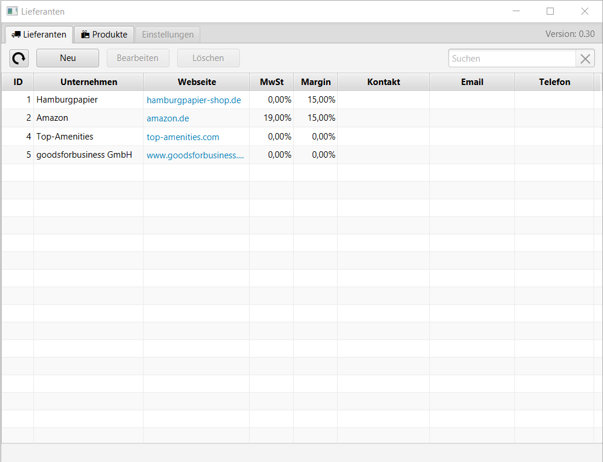
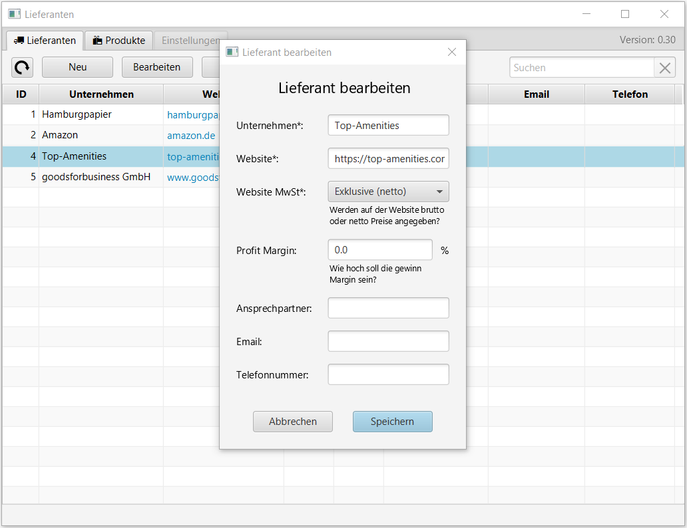
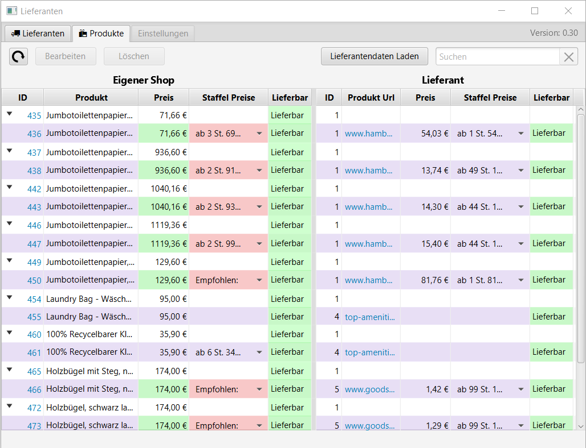
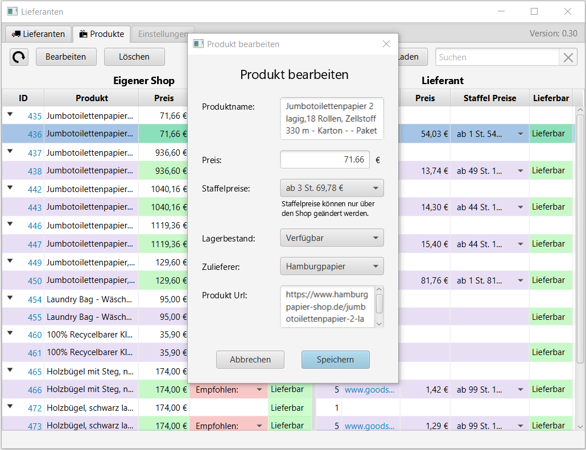

# Wordpress Lieferanten

Die **Wordpress Lieferanten** App, unterstützt Sie bei der Pflege ihrer Produkte aus Ihrem Woocommerce Shop.
Die App Prüft verfügbarkeiten und Preise der Lieferanten und aktuallisiert und Pflegt Ihre bereits Vorhandenen Produkte aus dem Shop.
Es kann eine Margin pro Liferant festgelegt werden, die auf die Produktpreis Automatisiert aufgerecht wird.

## Informationen
Diese App ist mit einer Demo Datenbank verbunden.
Sie Benötigen auch ein Hauseigenes Plugin Für ihren Woocommerce Shop um Ihre Lieferanten zu verwalten.

## Screenshots






## Systemanforderungen 🔧
Um diese Anwendung auszuführen, benötigen Sie mindestens JDK 20 oder eine neuere Version.

## Installation 🔌
Befolgen Sie diese Schritte, um die Anwendung auf Ihrem lokalen System zu installieren:

1. Laden Sie die Repository-Daten herunter, indem Sie den folgenden Befehl ausführen:
   ```shell
   git clone https://github.com/mikework24/WpLieferanten.git
   ```

2. Öffnen Sie das Projekt in IntelliJ IDEA oder einer anderen geeigneten Entwicklungsumgebung.

3. Starten Sie die Anwendung.